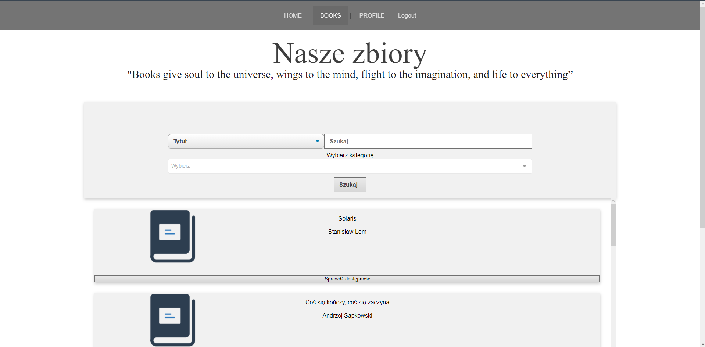
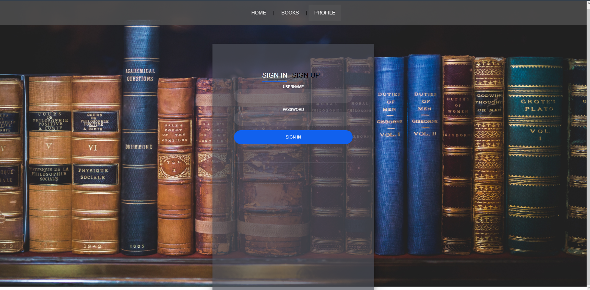
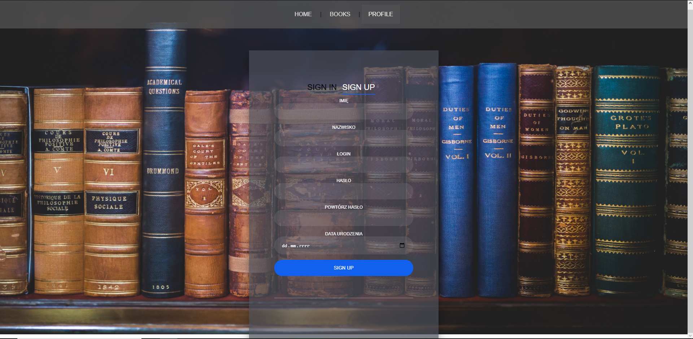
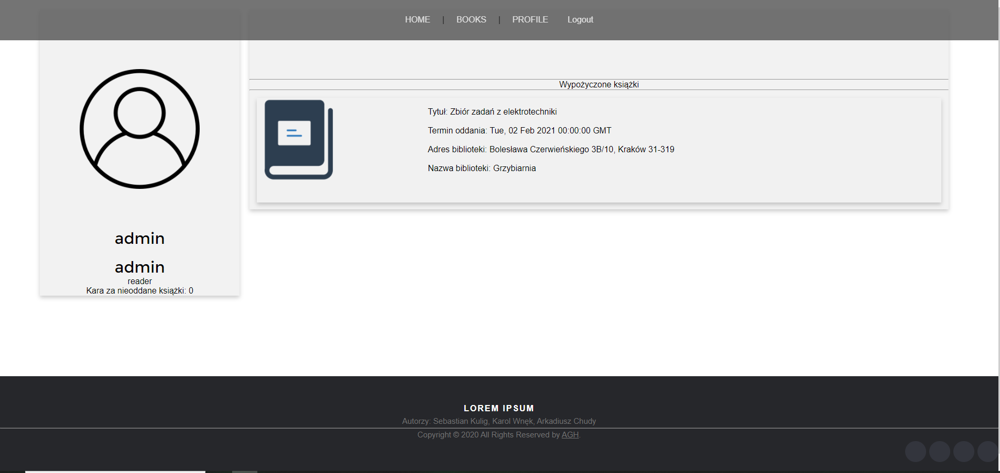
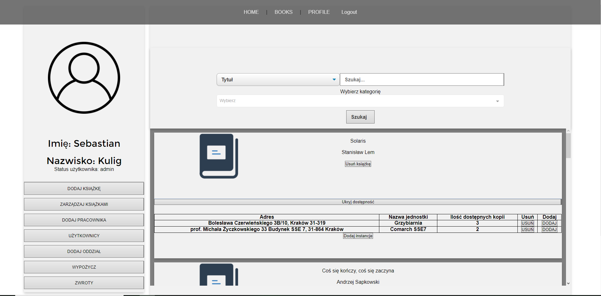
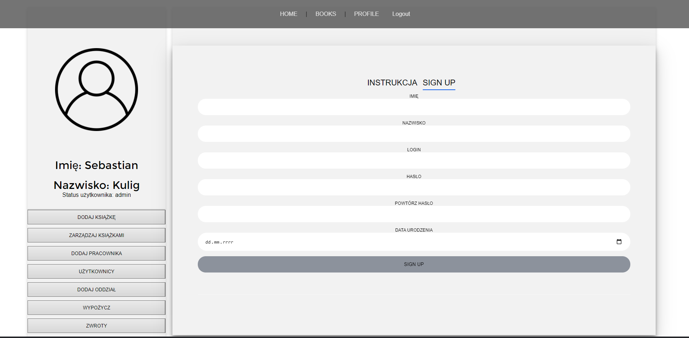
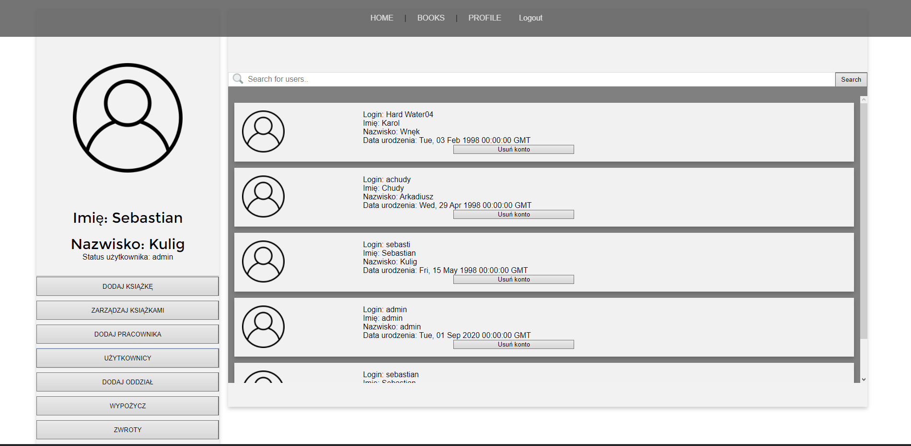
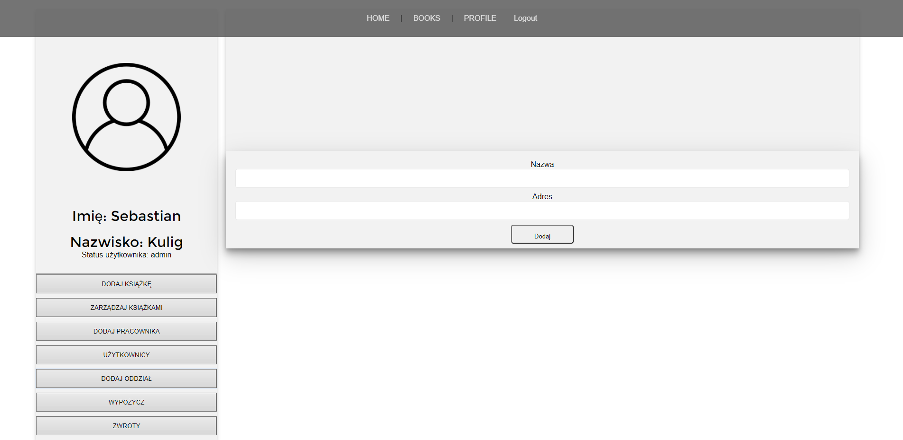
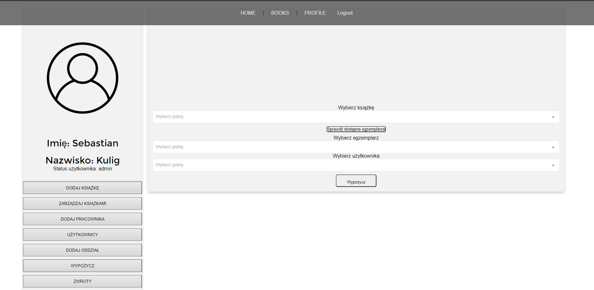
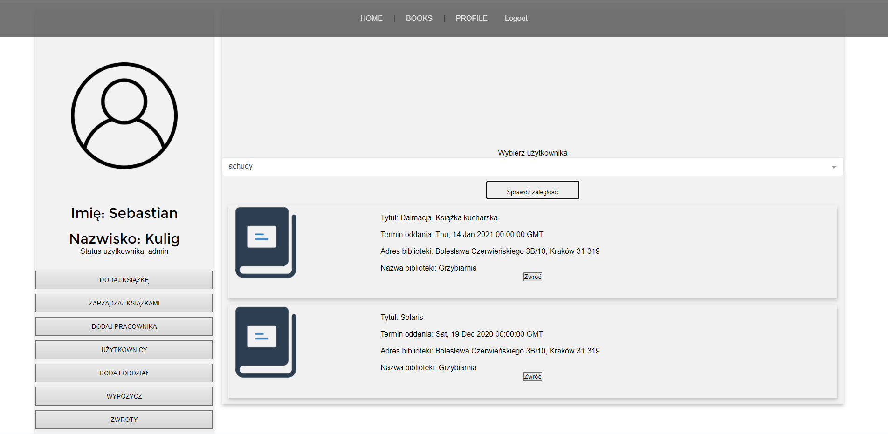

# Library API for Databases Project AGH

# Instrukcja Obsługi 

## Strona z punktu widzenia niezalogowanego użytkownika

Niezalogowany użytkownik ma dostęp do następujących widoków:
- Strona główna

- Wyszukiwanie książek. Istnieje możliwość filtrowana zasobów biblioteki po następujących kryteriach:
  - tytuł
  - autor
  - kategoria
  - połączenie kryteriów tytuł + kategoria lub autor + kategoria 

Po wyszukaniu konkretnej pozycji, możemy sprawdzić jej dostępność w różnych oddziałach

- Rejestracja

## Strona z punktu widzenia zalogowanego użytkownika (czytelnika)

Po zalogowaniu do strony pod zakładka profil dostępną są informacje o zalogowanym użytkowniku:
- dane osobowe
- kwota ewentualnych kar za zaległe książki
- wypożyczone książki

## Strona z punktu widzenia pracownika/admina
Jeśli zalogowany użytkownik ma uprawnienia administratorskie (jest pracownikiem biblioteki) to uzyskuje on dostęp do następujących opcji:
- możliwość dodawania nowych książek do zbiorów biblioteki. W celu dodania książki do biblioteki należy uzupełnić następujące pola:
  - tytuł
  - autor
  - oddział biblioteki
  - kategorię (istnieje możliwość wybrania kilku kategori do jednej książki)
  - jeśli kategoria do której chcemy dodać książkę nie istnieje możemy wpisać jej nazwę w polu "Dodaj nową kategorię", a następnie nacisnąć przycisk Dodaj. Kategoria powinna zostać automatycznie dodana do listy dostępnych kategorii
  - ilość instancji książki
  - oznaczenie, czy dana książka przeznaczona jest dla osob powyżej 18 raku życia

- zarządzanie bieżącymi zbiorami poprzez możliwość zwiększania lub zmniejszania ilości egzemplarzy danej pozycji
- usuwanie całej książki (wszystkich instancji) z zasobów biblioteki
- automatyczne uzupełnianie formularza dodawania książek w przypadku gdy chcemy dodać książkę, która już istnieje w jednym oddziale, do innego

- dodawanie kont nowych pracowników

- dostęp do danych czytelników oraz możliwość usunięcia ich kont

- możliwość dodawania nowych oddziałów (fili biblioteki)

- możliwość wypożyczania książek. W celu wypożyczenia książki należy wybrać książkę, która chcemy wypożyczyć, następnie naciskamy przycisk "Sprawdź dostępne egzemplarze " w celu wygenerowania listy dostępnych instancji. Teraz możemy wybrać użytkownika do którego chcemy przypisać daną instancję. Po nacisnięciu przycisku "Wypożycz" książka zostanie wypożyczona danemu użytkownikowi 

- przyjmowanie zwrotów. W celu zwrócenia książki wyszukujemy użytkownika po loginie i naciskamy "Sprawdż zaległości". Wygenerowan zostanie lista książek wypożyczonych przez danego użytkownika. Jeśli chcemy zwrócić daną pozycję wystarczy nacisnąć przycisk zwróć znajdujący się w rekordzie dostyczącym danej książki.

