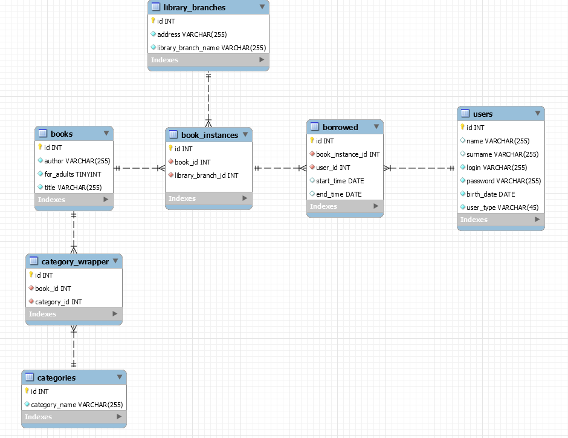

# This directory contains database dump and its short description
## EER Diagram of DB

## Table of Contents
- [Triggers](#triggers)
  * [can_user_borrow](#can_user_borrow)
- [Functions](#functions)
  * [cash_penalty](#cash_penalty)
- [Procedures](#procedures)
  * [add_new_book](#add_new_book)
  * [calculate_cash_penalty](#calculate_penalty)
  * [check_availability](#check_avail)
  * [delete_books](#delete_book)
  * [get_books_by_category](#get_books_by_cat)
  * [get_books_filter](#get_category_of_book)
  * [get_category_of_book](#get_category_of_book)
  * [get_users_books](#get_user_book)

## Triggers
* ##### can_user_borrow
    This is `BEFORE INSERT` type trigger which prevents from a situation when user can borrow a new book when he is behind with the previous ones. In this case the trigger returns list of ids of books, which need to be returned.
    It also limits maximum the number of books rented at the same time to 5. Uppon successful insert the return date is set to `sysdate + 14`.

## Functions
* ##### cash_penalty
    This functions calculates how much money the reader owes to the library. Book penalty equals difference in days between return date and now, multiplied by a 0.25. Total penalty is the sum of book penalties. 
    Input arguments:
    + login:`VARCHAR(255)`, login of the user for whom the penalty is to be calculated 

## Procedures
* ##### add_new_book
    This procedure adds a new book to the library 
    Input parameters:
    + book_title: `VARCHAR(255)`, new book's title
    + book_author: `VARCHAR(255)`, new book's author
    + for_adults: `TINYINT`, age restriction flag, 1 means 'for adults', 0 'for everyone'
    + library_branch: `INT`, library branch ID in which the book is stored.
    + category_names: `VARCHAR(512)`, string that contains category names of a book. Categories are delimitted by a comma. For example: 'przygodowe,historyczne,podróżnicze'
    + number_of_book_instances: `INT`, number of copies that are being added 
Returns:
calculated penalty
* ##### calculate_cash_penalty
    It runs a `cash_penalty` function using provided user login. 
    Input parameters: 
    + login: `VARCHAR(255)`, login of the user for whom the penalty is to be calculated
* ##### check_availability
    
* ##### delete_books
* ##### get_books_by_category
* ##### get_books_filter
* ##### get_category_of_book
* ##### get_users_books
