# Library system

## Project setup
```
npm install
```

### Compiles and hot-reloads for development
```
npm run serve
```

### Compiles and minifies for production
```
npm run build
```

### Lints and fixes files
```
npm run lint
```

### Customize configuration
See [Configuration Reference](https://cli.vuejs.org/config/).

# Instrukcja Obsługi 

## Strona z punktu widzenia niezalogowanego użytkownika

Niezalogowany użytkownik ma dostęp do następujących widoków:
- Strona główna

* Wyszukiwanie książek. Istnieje możliwość filtrowana zasobów biblioteki po następujących kryteriach:
             * tytuł
             * autor
             * kategoria
             * połączenie kryteriów tytuł + kategoria lub autor + kategoria 


Po wyszukaniu konkretnej pozycji, możemy sprawdzić jej dostępność w różnych oddziałach
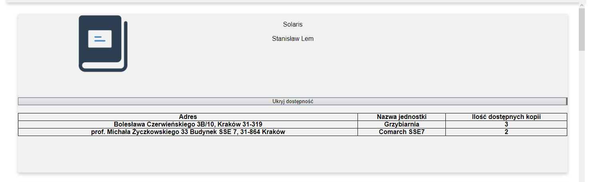
- Rejestracja
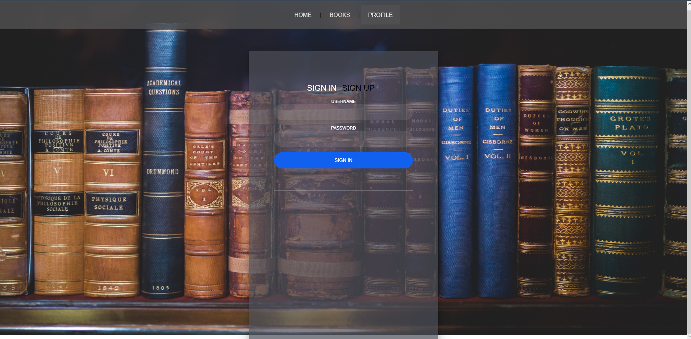
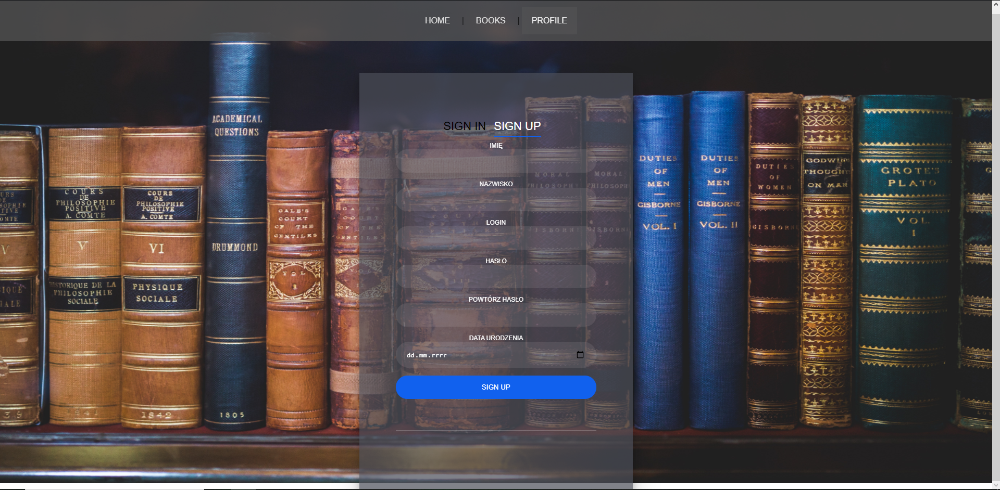


## Strona z punktu widzenia zalogowanego użytkownika (czytelnika)

Po zalogowaniu do strony pod zakładka profil dostępną są informacje o zalogowanym użytkowniku:
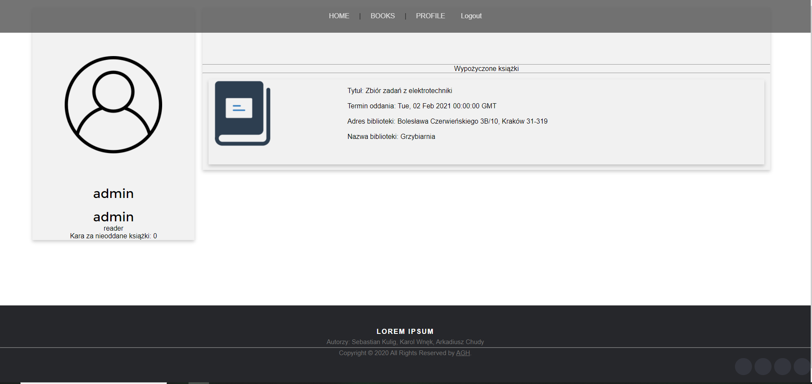
- dane osobowe
- kwota ewentualnych kar za zaległe książki
- wypożyczone książki


## Strona z punktu widzenia pracownika/admina
Jeśli zalogowany użytkownik ma uprawnienia administratorskie (jest pracownikiem biblioteki) to uzyskuje on dostęp do następujących opcji:
- możliwość dodawania nowych książek do zbiorów biblioteki
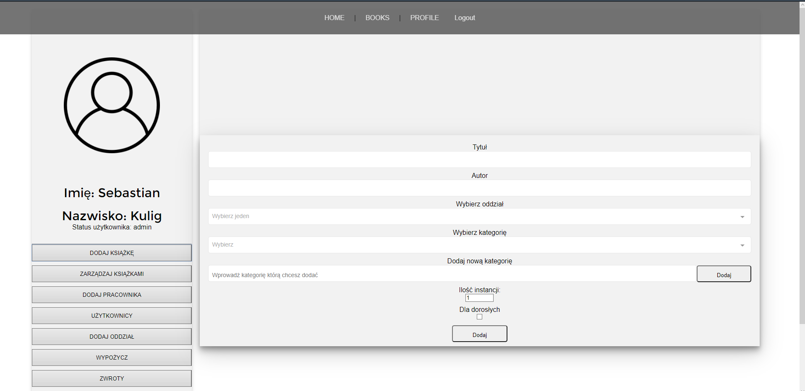
- zarządzanie bieżącymi zbiorami poprzez możliwość zwiększania lub zmniejszania ilości egzemplarzy danej pozycji, usuwanie całej książki (wszystkich instancji) z zasobów biblioteki, automatyczne uzupełnianie formularza dodawania książek w przypadku gdy chcemy dodać książkę, która już istnieje w jednym oddziale, do innego
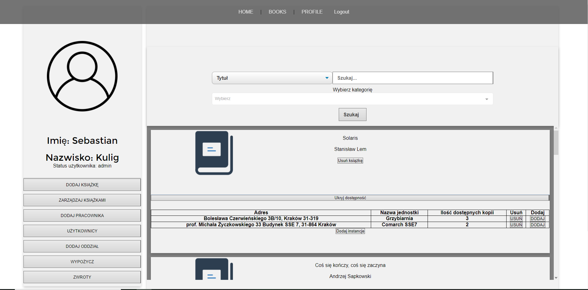
- dodawanie kont nowych pracowników
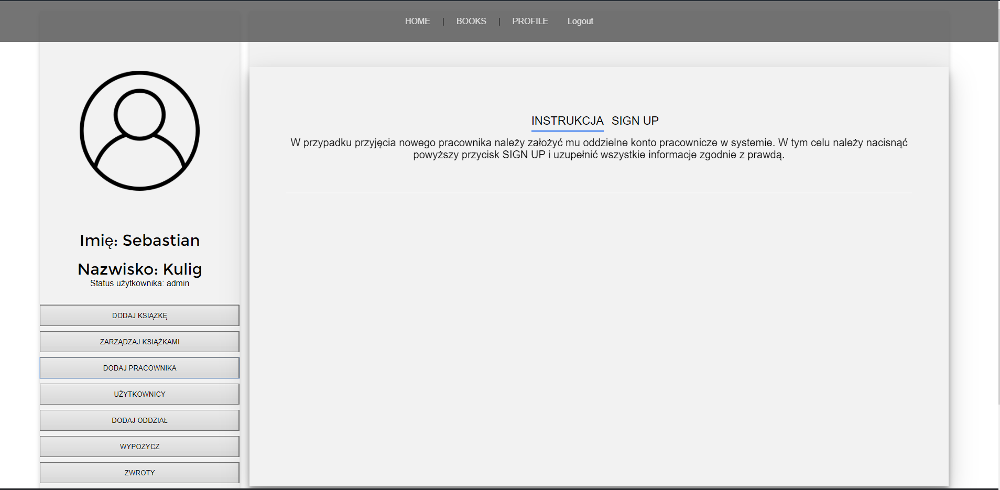
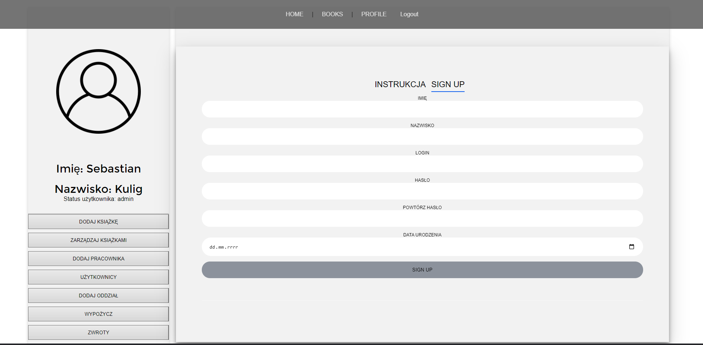
- dostęp do danych czytelników oraz możliwość usunięcia ich kont
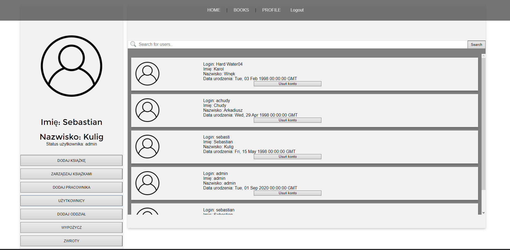
- możliwość dodawania nowych oddziałów (fili biblioteki)
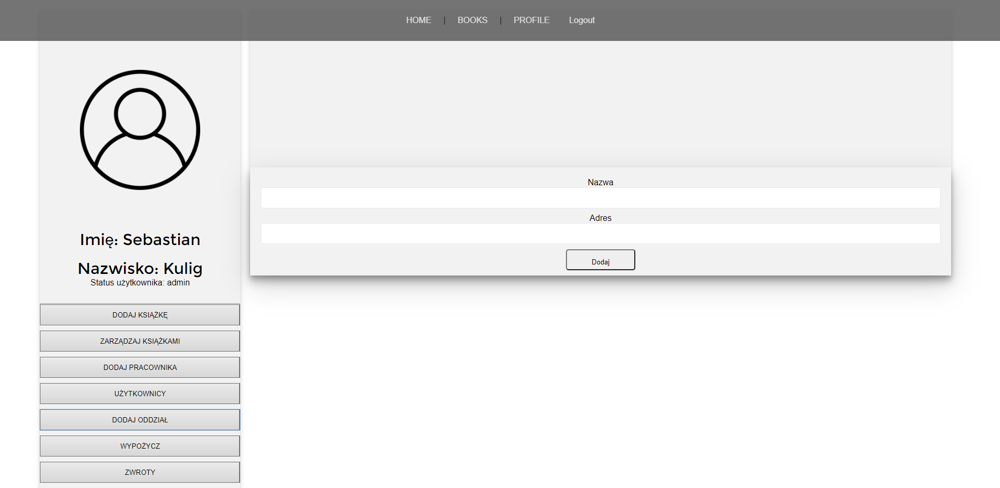
- możliwość wypożyczania książek
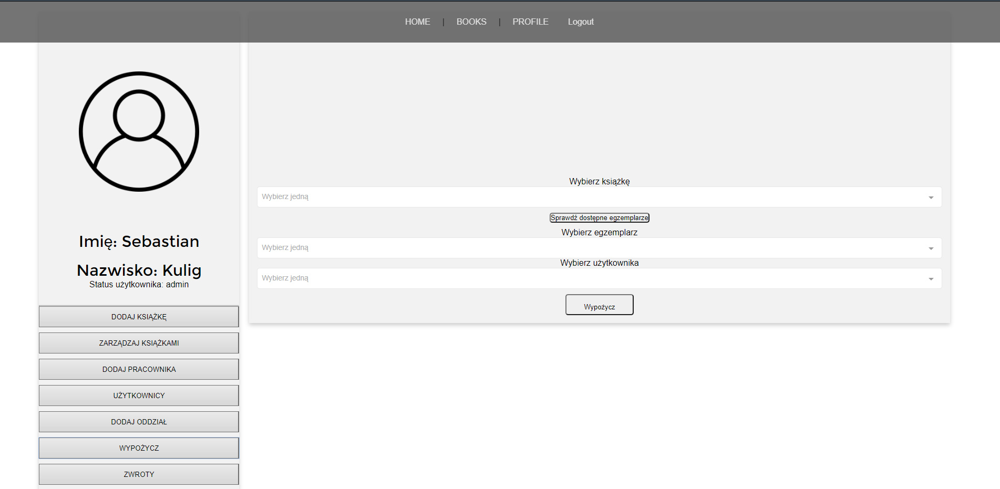
- przyjmowanie zwrotów
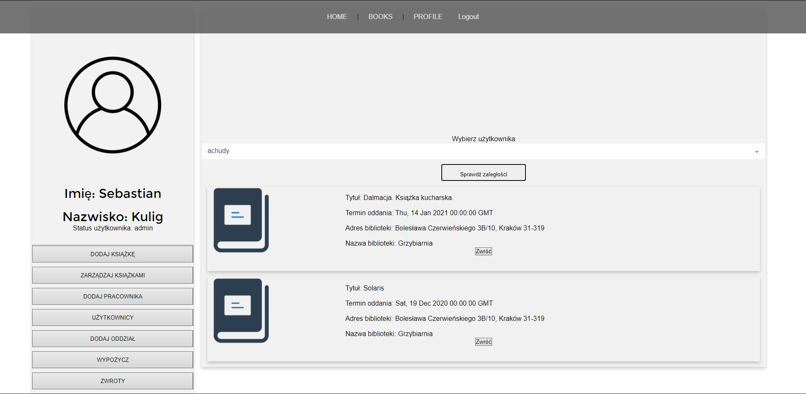
 
